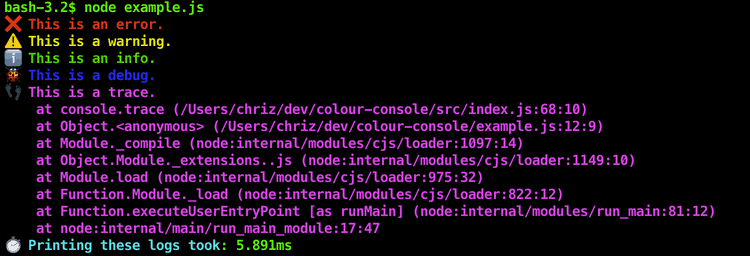
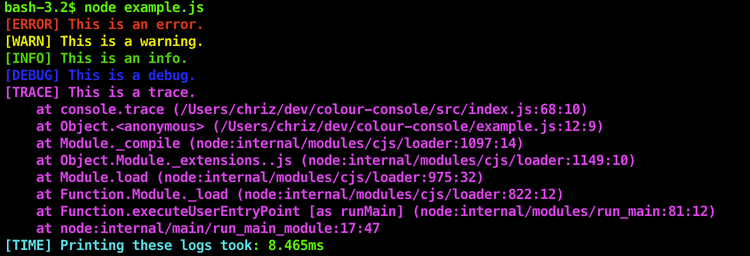

# colour-console (for node.js)

[](https://github.com/chrisEff/colour-console/blob/master/LICENSE)
[](https://www.npmjs.com/package/colour-console)

So you're working on this small node.js project where you have a lot of `console.error()`/ `warn()` / `debug()` statements
and you just want the output to look a little more colourful?

Well sure, you could find yourself a full-blown logging framework which does this (and a lot of other fancy things),
but this seems a little overkill?
(Or maybe you're just too lazy to do that right now? Which is okay - I don't judge you. 😉)

Look no further! With this package you have found exactly what you need!

Just install it, import it once at the top of you project's entry file and forget about it!

`npm i colour-console` or `yarn add colour-console`

```js
require('colour-console')

console.time('Printing these logs took')

console.error('This is an error.')
console.warn('This is a warning.')
console.info('This is an info.')
console.debug('This is a debug.')
console.trace('This is a trace.')

console.timeEnd('Printing these logs took')
```



## But I don't like those ugly emojis!

Don't worry, I got you covered! Just set:

```js
console.useEmoji = false
```

right after importing this package and you're good:



## Can I get some colours that are a little less bright?

No problem! Just set:

```js
console.useBrightColors = false
```


